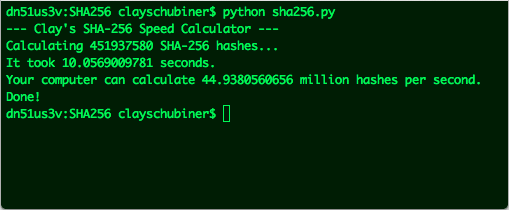

SHA-256 Speed Calculator for Bitcoin Mining Revenue Estimation
======

This Python program simply calculates a large number of SHA-256 hashes to determine how quickly your computer can calculate hashes. Results are returned in millions of hashes calculated per second.

You can use this information to figure out your expected profits gained by mining bitcoins. See here:
http://tpbitcalc.appspot.com/

For reference, my 2011 Macbook Pro can generate about 45 million hashes per second, yielding an estimate of 7447.2 days to mine one block!

